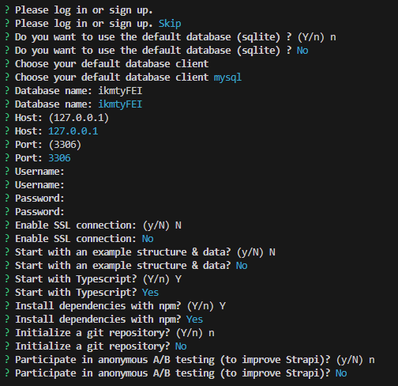

# Framework e Interoperabilidad

## Año 2025 - Tecnicatura Universitaria en Desarrollo Web

## Trabajo práctico Nº 2 - CMS y Frameworks Web

## Estudiantes:

- [FAI-3169] Benitez, Franco Fabian
- [FAI-4594] Pesce, Matías Nicolás
- [FAI-3220] Reyes Castelló, José Vicente

## Dominio

<h3> <i> I Know More Than You! </i> </h3>


## Ejercicio 2

Se encuentra en la rama "Ej2", el primer commit consiste en el template sin modificación y los siguientes donde se realizaron todas las modificaciones.

## Ejercicio 3

Se encuentra en la rama "Ej3" que utiliza de origen la rama "Ej2".

## Aclaraciones

- Debido a que el template era un HTML plano con CSS y una mínima funcionalidad con un script javascript, el mismo se adaptó al entorno de React utilizando Typescript de la manera más fidedigna posible, por lo que consideramos el mismo como el punto inicial del template para modificar.

- La base de datos utiliza el motor MySQL en la plataforma XAMPP.

- En el archivo "db schema.sql" se encuentra la estructura de la base de datos para utilizar el módulo realizado con Laravel (Observación: si realiza una migración de la base de datos desde la línea de comandos, la cual se detalla más adelante, no es necesario crear manualmente la base de datos ni sus tablas).<br> 
En el mismo archivo también se encuentran datos precargados para poder visualizar el <i><b>Módulo 3: Interfaz de trivia con muestra de opciones y selección de respuesta</i></b>, que deben ser agregados manualmente en la base de datos.

- Para poder utilizarlos es necesario correr los siguientes comandos en la consola desde la ruta principal:
    - Para el frontend:
    ```bash
    cd .\Frontend\
    npm install
    cp .env.example .env
    ```
    - Para el CMS:
    ```bash
    cd .\Strapi-TP2-FEI\
    cp .env.example .env
    npm install
    ```
    Observación: Durante la instalación de strapi se le va a solicitar una serie de opciones de configuración, recomendamos utilizar las mismas que en la siguiente imágen:
    <details>
        <summary>Configuración de instalación</summary>
        
    </details>
    <br>

    - Para Laravel:
    ```bash
    cd .\Laravel-TP2-FEI\
    cp .env.example .env
    ```
    ```bash
    php artisan key:generate
    ```
    ```bash
    php composer install
    ```
    ```bash
    php artisan migrate
    ```
    ```bash
    php artisan serve
    ```
- Los archivos .env de cada subdirectorio deben contener los siguientes parámetros:
Para el frontend debe contener:
```js
VITE_API_STRAPI=http://localhost:1337/api
VITE_API_LARAVEL=http://localhost:8000/api
```
Para el framework Laravel:
```js
DB_CONNECTION=mysql
DB_HOST=127.0.0.1
DB_PORT=3306
DB_DATABASE=ikmtyfei
DB_USERNAME=root
DB_PASSWORD=
CACHE_STORE=file
```
Para el CMS Strapi:
```js
# Database
DATABASE_CLIENT=mysql
DATABASE_HOST=127.0.0.1
DATABASE_PORT=3306
DATABASE_NAME=ikmtystrapi
DATABASE_USERNAME=root
DATABASE_PASSWORD=
DATABASE_SSL=false
DATABASE_FILENAME=
```